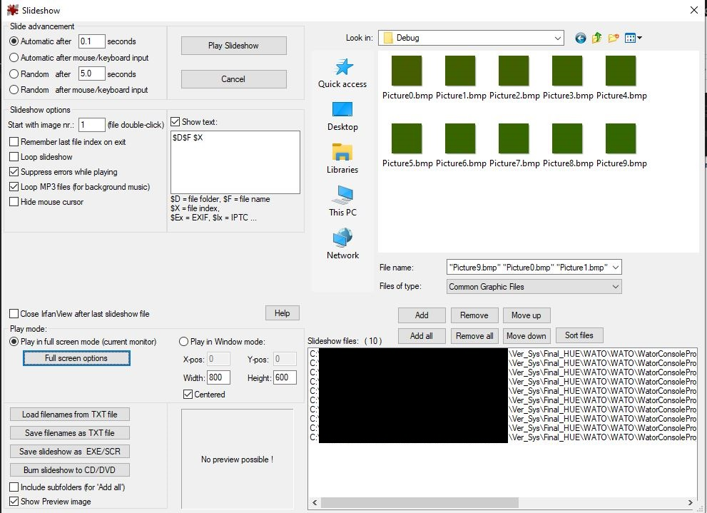

# Parallelisierungs-Paper WATOR
## Von Mandl Matthias und Vadle Peter

### Aufbau Ordner / How To:
Das Program wurde in Visual Studio 2022 geschrieben.</br>
Das Tracefile befindet sich unter:</br>
WATO\WatorConsoleProj\bin\Debug\trace.txt</br>
Die Bilder befinden sich unter:</br>
WATO\WatorConsoleProj\bin\Debug\PictureX.bmp

Zum Ausführen, das Projekt WatorConsoleProj starten.

Zum darstellen der Bilder wurde die slideshow IrfanView verwendet. Hierzu: 
 File=>Slideshow=>Rechts zum Ordner navigieren, die Bilder markieren "Add All"(optional: Links oben "Automatic after" z.B. 0.1 Sekunden + links unten "Full Screen Options"=> "Full screen / Slideshow" => option 3 + Häckchen weg bei "Use Resamble function for first display on an image")

</br>


## Konzepterstellung
Zu aller erst, haben wir das Problem analysiert und durchgeschaut, welche der "Algorithm Structure Patterns" und "Supporting Structure Patterns" wir für dieses Problem verwenden könnten.
In Frage gekommen sind für uns in erster Linie für "Algorithm Structure Patterns": 
- Geometric decomposition
- Divide and Conquer

"Geometric decomposition" hat nach weiteren Überlegungen mehr Sinn als "Divide and Conquer" für dieses Beispiel gemacht. 
In Divide and Conquer wäre es schwieriger und mit mehr Aufwand verbunden gewesen, die Teile zu zerteilen und wieder zusammen zu führen.  
Die Berechnungen wären wahrscheinlich nicht aufwendig genug gewesen um das Erstellen der Tasks zu kompensieren.

Und für "Supporting Structure Patterns":
- Master / Worker
- Distributed array
- Shared Queue


## Erster Versuch / erste Version
Unsere erste Überlegung war es, ein großes 2D Array zu haben und Geometric decomposition, Master / Worker, Distributed Array und Shared Queue zu verwenden. Dieses 2D Array sollte in Vierecke zerteilt werden und eine Position zugeordnet bekommen. Diese Viereck-Array-Teile werden in eine Output-SharedQueue gesteckt worauf alle Worker Zugriff haben. Ein zufälliger Worker nimmt dieses Viereck-Array-Teil, berechnet es und steckt es in die Input-SharedQueue. Der Master hört ständig auf die Input-SharedQueue und fügt die kommenden Teile in das große 2D Array zusammen. 


Nachteile:
- Die Queues sind ein Bottleneck, da alle auf die gleiche Queue zugreifen
- Der Master hat sehr viel Arbeit die Teile zusammenzuführen, aufzuteilen und in die Queue zu stecken.
- Das 2D Array in Vierecke aufzteilen bringt Komplexität oder Einschränkungen mit sich. Etwa man schränkt die Möglichkeiten so ein, dass die Anzahl der Threads n^4 sein muss, sprich 4-16-64-256 und das 2D Array auch in so viele gleichgroße Vierecke Teilbar ist. Oder man muss viele Fälle berücksichtigen, wie 3x3, ungleiche Vierecke, z.b. 10x10 mit 2 Threads. Diese Fälle würden eine vermeidbare Komplexität in den Code bringen. 


## Zweite / finale Version
Nachdem die erste Version viele Nachteile mit sich bringt, wurde versucht das Konzept zu überarbeiten und die Probleme der ersten Version zu minimieren.
- Anstatt Vierecke zu verwenden wird das 2D Array in Zeilen-Teile zerteilt. Hiermit ist das Zerteilen einfacher und die Anzahl an Threads flexibler. (Einschränkung Pixel Modulo Threads == 0)
- Jedes Zeilen-Teil hat hierbei seine Zeilen und die Ghost Boundaries.
- Anstatt Queues zu verwenden übergibt der MasterThread die Payloads direkt an den jeweiligen Worker. Der WorkerThread ruft dann selbst das event auf, bei dem seine Daten in das "Master-2D-Array" geschrieben werden und der Master hat hiermit keinen Aufwand. 

### Ablauf
Master Thread:
- Der Master wird mit der Anzahl an Threads und dem initialen List< List< bool>> Bild initialisiert.
- Der Master erstellt die Anzahl an Worker und fügt sie einer Liste An Worker hinzu. Jeder Worker wird gestartet und einem Event angehängt.
```c#
worker.FireOnWorkerIsDone += Worker_WorkerIsDone;
```
- [SplitDataGrid] Der Master zerteilt das Bild in Payloads, welche ein 2D Array und eine Rownumber beinhalten. Das 2D Array beinhaltet die zugewiesenen Zeilen inklusive der GhostBoundaries. 
- [DistributeWork] Der Master verteilt die Arbeit an die Worker und gibt jedem eine Payload (die Reihenfolge ist hierbei egal, da die Payload die "Rownumber" hat) 
- Nun geht der Master so lange schlafen, bis alle Worker mit dem derzeitigen Bild fertig sind und er wieder von vorne anfangen kann
  
Worker Thread:
- Sobald der Worker eine Payload erhaltet, wird er auf "working" gesetzt und arbeitet soald er am Zug ist
- [CalculatePayload] Der Worker berechnet seine zugewiesene Payload inklusive Ghost Boundaries und leifert die berechnete Payload ohne Ghost Boundaries zurück. 
- Nun feuert der Worker das event [FireOnWorkerIsDone] mit seiner payload. Hierbei wird [Worker_WorkerIsDone] in der Masterklasse, aber noch im WorkerThread ausgeführt. Dieser Teil wird gelockt.
- [FillPublishedCreatedImage] Hierbei wird die berechnete Payload des Workers auf das List< List< bool>> Bild des Masters überschrieben.
- Falls alle Worker fertig sind wird das Bild dem [BitmapCreator] übergeben und der Master startet wieder von vorne.
- Falls [BitmapCreator.PicturesTillSave] X viele Bilder gespeichert wurden, wird die verbrauchte Zeit für die Berechnung in das trace.txt Logfile geschrieben und die Bilder zuerst mit Parallel.ForEach in Bitmaps umgeformt und anschließend mithilfe des [ImageSaver]s mithile von Parallel.For, Parallel in Files geschrieben. (Die IO Aufgaben benötigen sehr viel Zeit. deswegen werden sie erst nach X vielen Bildern durchgeführt und bei der Zeitmessung nicht mitgerechnet. Mithilfe des Parallel.For wird versucht das Speichern der Bilder möglichst kurz zu halten) ([Parallel.For](https://docs.microsoft.com/en-us/dotnet/api/system.threading.tasks.parallel.for?view=net-6.0#system-threading-tasks-parallel-for(system-int64-system-int64-system-action((system-int64)))) mithilfe von [ParallelOptions](https://docs.microsoft.com/en-us/dotnet/api/system.threading.tasks.paralleloptions?view=net-6.0) .[MaxDegreeOfParallelism ](https://docs.microsoft.com/en-us/dotnet/api/system.threading.tasks.paralleloptions.maxdegreeofparallelism?view=net-6.0#system-threading-tasks-paralleloptions-maxdegreeofparallelism) lässt die maximale anzahl an Threads angeben. Diese wird in unserem Fall auf die anzahl der Worker gesetzt, also z.B. 1,2,4,8,16 )
- Anschließend legt sich der Worker wieder schlafen, bis er eine neue Aufgabe zugewiesen bekommt


## Klassendiagram:


## Sequenzdiagram 
(durch die Threads ist die Reihenfole von Worker nicht immer gleich, dies ist eine Beispiel-Abfolge) 


Hier wird Beispielsweise die Payload von Worker2 dargestellt. Er bekommt die Zeilen 2,3,4,5,6 (gelb+grün) sendet aber nur die Zeilen 3,4,5 (grün) zurück. Die gelben Kästchen sind hierbei die Ghost-Boundaries</br>


## Performance Analyse:
### Matthias PC 10000x10000 Pixel, X Threads, Messung für Berechnung von 10 Bilder:
At [06:16:54.856] Timespan for 10 Rounds: **00:02:25.5450722** with 1 workers with 10000x10000 pixels</br>
At [06:19:05.437] Timespan for 10 Rounds: **00:01:37.8710541** with 2 workers with 10000x10000 pixels</br>
At [06:20:46.626] Timespan for 10 Rounds: **00:01:07.2211853** with 4 workers with 10000x10000 pixels</br>
At [06:22:30.209] Timespan for 10 Rounds: **00:01:05.4831889** with 8 workers with 10000x10000 pixels</br>
At [06:24:21.811] Timespan for 10 Rounds: **00:01:06.4279996** with 16 workers with 10000x10000 pixels</br>
At [06:25:49.512] Timespan for 10 Rounds: **00:01:05.5579848** with 32 workers with 10000x10000 pixels</br>
